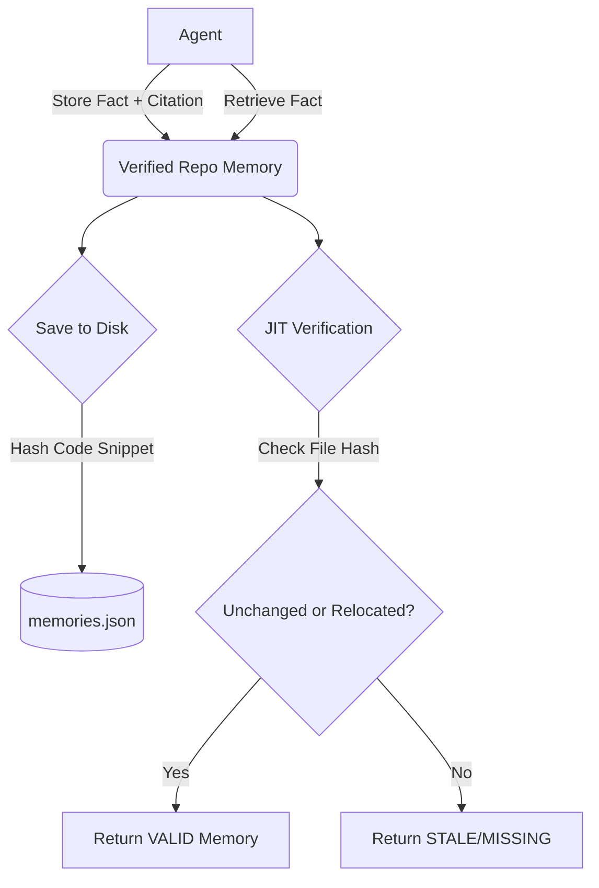

# Verified Repo Memory MCP v0.1.2

[](https://github.com/cognitivemyriad/mcp-verified-repo-memory/actions/workflows/ci.yml)
[](https://www.typescriptlang.org/)
[](https://opensource.org/licenses/MIT)

Stale-proof repository memory with citations + just-in-time verification + TTL (repo-scoped).

An MCP server providing "safe memory" for AI coding agents. Memories are scoped per repository, backed by code citations, and verified just-in-time so an agent never receives stale information when the underlying code has changed.

## Quickstart

Run via `npx`:

```bash
npx -y @cognitivemyriad/vrm-local --repo /path/to/repo
```

*(Alternatively, run from source: `npm ci && npm run build && node build/index.js --repo /path/to/repo`)*

## Tools

* **`vrm_store`**: Store a new memory with file citations.
* **`vrm_search`**: Search for candidate memories by keywords.
* **`vrm_retrieve`**: JIT-verify candidates and return only valid memories. (Main tool for agents)
* **`vrm_list`**: List memories by status (valid, stale, missing).
* **`vrm_forget`**: Manually delete a memory.

### Example I/O

**Store:**
Input:
```json
{
  "subject": "API version sync",
  "fact": "When changing API version, update client/server/docs together.",
  "citations": [{ "path": "src/api.ts", "startLine": 10, "endLine": 15 }]
}
```
Output:
```json
{
  "stored": true,
  "memoryId": "uuid-...",
  "expiresAt": "2026-03-21T00:00:00Z"
}
```

**Retrieve:**
Input:
```json
{ "query": "API version" }
```
Output:
```json
{
  "query": "API version",
  "valid": [ ... ],
  "stats": { "verified": 1, "validCount": 1 }
}
```

## How it works



1. **Citations:** Every fact is linked to a file path and a line range. The exact code snippet is hashed and saved.
2. **JIT Verification:** Before returning a memory to the agent in `vrm_retrieve`, the server checks the physical file. If the snippet has moved, it relocates the citation. If it has been changed or deleted, the memory is marked STALE/MISSING and omitted from the results.
3. **TTL (Time-To-Live):** Memories expire automatically (default 28 days) unless they are successfully retrieved and utilized, which extends their life.

## Data location

Data is strictly repo-scoped and saved in:
`<repoRoot>/.verified-repo-memory`

This includes `memories.json` and a fingerprint/metadata file to prevent accidental cross-repo pollution. Add this directory to your `.gitignore`.

## Security

* **No Network Transmissions:** This is a `stdio` local-only server without HTTP calls.
* **Path Security:** Disallows any path traversal (`../`) out of the repository root, as well as accessing `.git/` or `.verified-repo-memory/`.
* **No Stdout Pollution:** Strict logging only to `stderr`.
* **Secret Scan:** Built-in heuristic secret scanning to reject memories that look like API keys/private keys (can be disabled via `--no-secret-scan`).

## Usage with Claude

### Claude Desktop
To add this server to the Claude Desktop app, edit your configuration file:
- On macOS: `~/Library/Application Support/Claude/claude_desktop_config.json`
- On Windows: `%APPDATA%\Claude\claude_desktop_config.json`

Add the following configuration:
```json
{
  "mcpServers": {
    "verified-repo-memory": {
      "command": "npx",
      "args": [
        "-y",
        "@cognitivemyriad/vrm-local",
        "--repo",
        "/absolute/path/to/your/repo"
      ]
    }
  }
}
```

### Claude Code
To add this server to Claude Code using `stdio` transport:

```bash
claude mcp add mcp-verified-repo-memory --transport stdio -- npx -y @cognitivemyriad/vrm-local
```

*Note for Windows users:* You may need to prepend `cmd /c` to the command:
```bash
claude mcp add mcp-verified-repo-memory --transport stdio -- cmd /c npx -y @cognitivemyriad/vrm-local
```

---

## Publishing Guide

This section explains how to publish the package to **NPM** and register it with the **Anthropic MCP Registry** so that it becomes publicly available.

### Step 1: Publish to NPM

NPM (Node Package Manager) is the package distribution platform. Publishing here allows anyone to install your tool with a single command.

#### Prerequisites

- An [NPM account](https://www.npmjs.com/signup) (free)
- Two-factor authentication (2FA) enabled on your NPM account
- Node.js installed on your machine

#### Procedure

**1. Log in to NPM from the terminal:**

```bash
npm login
```

A browser window will open. Sign in with your NPM account. When prompted, enter your 2FA code from your authenticator app.

**2. Publish the package:**

```bash
npm publish --access public
```

This command does the following:
- Compiles TypeScript → JavaScript (`npm run build`)
- Creates a `.tgz` archive of the compiled files
- Uploads the archive to `https://registry.npmjs.org/`

**3. Verify the publication:**

Visit `https://www.npmjs.com/package/@cognitivemyriad/vrm-local` in your browser. Your package page should appear.

> **Note:** If you need to re-publish, you must increment the version number in `package.json` and `server.json` first (`npm version patch`). NPM does not allow overwriting existing versions.

---

### Step 2: Register with Anthropic MCP Registry

The [MCP Registry](https://registry.modelcontextprotocol.io) is Anthropic's official directory of MCP servers. Registering here allows Claude Desktop, Claude Code, and other MCP clients to discover and install your server.

> **Important:** The NPM package **must be published first** (Step 1). The MCP Registry validates that the NPM package exists before accepting the registration.

#### Prerequisites

- A [GitHub account](https://github.com) (used for authentication only)
- The `mcp-publisher` CLI tool

#### Installing mcp-publisher

```bash
# macOS (Homebrew)
brew install nicholasgriffintn/tap/mcp-publisher

# Or via npx (no install required)
npx @anthropic-ai/mcp-publisher
```

#### Procedure

**1. Log in to the MCP Registry via GitHub:**

```bash
mcp-publisher login github
```

A browser window will open. Authorize the application with your GitHub account.

**2. Publish to the MCP Registry:**

```bash
mcp-publisher publish
```

This command reads `server.json` in the current directory and registers the server with the MCP Registry. The registry will:
- Validate the `server.json` schema
- Check that the NPM package exists and is accessible
- Register the server metadata (name, description, version, environment variables)

**3. Verify the registration:**

Visit `https://registry.modelcontextprotocol.io` and search for your server name.

> **Note:** Once a version is published to the MCP Registry, it is **immutable** and cannot be changed. To publish updates, increment the version in both `package.json` and `server.json`, publish to NPM first, then run `mcp-publisher publish` again.

---

### Version Management

When releasing a new version, always update the version number in **all three locations**:

```bash
# 1. Bump version in package.json
npm version patch  # 0.1.2 → 0.1.3

# 2. Update server.json (both top-level and packages[].version)
# Edit server.json manually to match the new version

# 3. Publish
npm publish --access public
mcp-publisher publish
```

| File | Field | Must Match |
|------|-------|-----------|
| `package.json` | `version` | ✅ |
| `server.json` | `version` (top-level) | ✅ |
| `server.json` | `packages[0].version` | ✅ |
